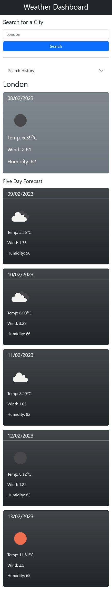
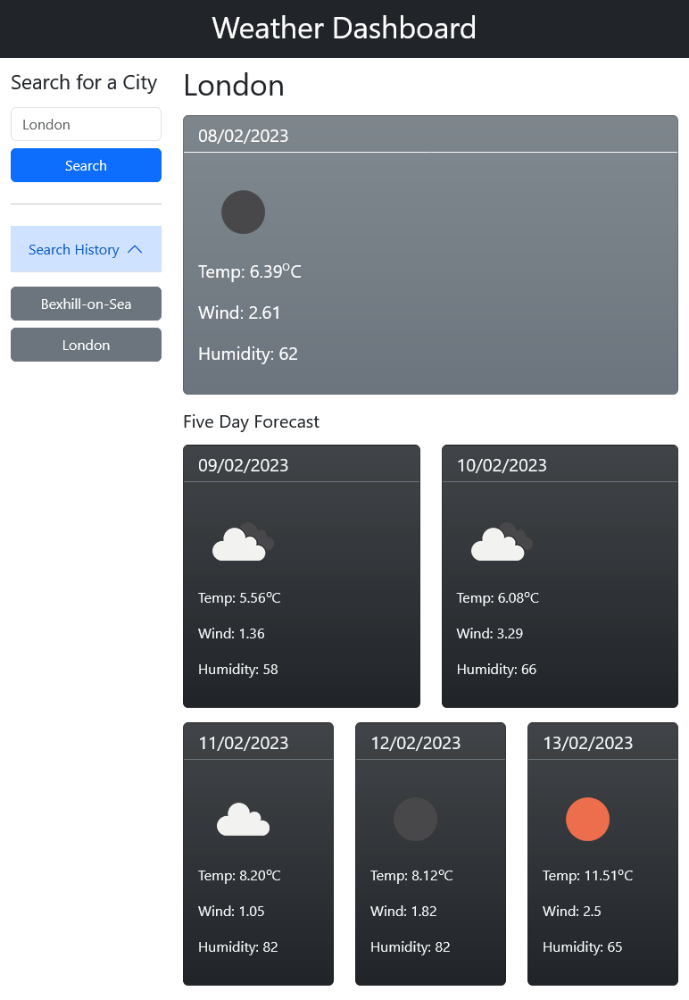
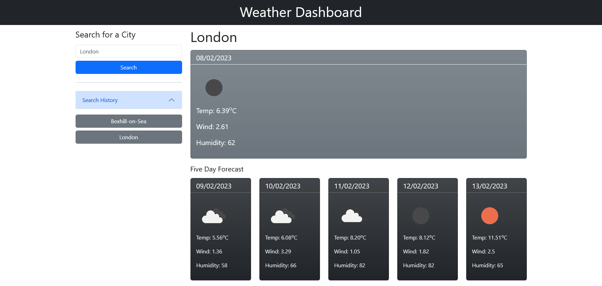

# Weather Dashboard

## Description

Uses the [5 Day Weather Forecast API](https://openweathermap.org/forecast5) to retrieve weather data for cities. It displays and stores the cities, if found, in local storage for a limited time to allow the user access to the latest forecasts.

It only uses Bootstrap and no other CSS. It is built to be responsive from the start, for most screen sizes.
This is to allow quick prototyping and a good base for a design to be later transformed using CSS, if required.

## Installation

N/A

## Usage

The user should enter a city name into the search box and click the search button to get the 5 day forecast for that city.

If a user has already made a successful search then that city will be displayed in the search history. The user can then click on that city button to display the 5 day forecast for that city, without hitting the API again.

If a user is on a small size screen, then the search history accordian can be collapsed by clicking on it to allow less scrolling down to see the forecasts.

View deployed application: [Weather Dashboard](https://warrentyler.github.io/weather-dashboard/)

Small screen size:

Medium screen size:

XXL screen size:

## Credits

Thanks to Helena.

## License

N/A.
